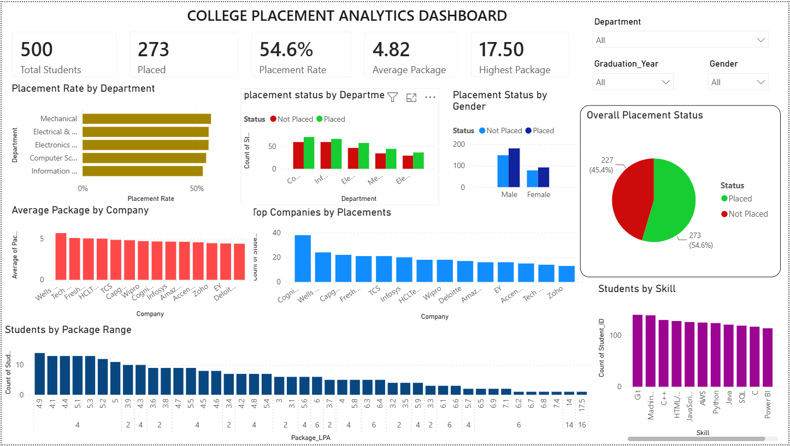

College Placement Analytics Dashboard

An interactive College Placement Analytics Dashboard built using Microsoft Power BI to analyze student placement performance, companies, salary packages, skills, internships, and department-wise trends.

## Problem Statement

College placement data is often maintained across different records, making it difficult to quickly understand placement performance, company recruitment, salary trends, and department-wise outcomes.

## Solution

This project consolidates placement-related data into an interactive Power BI dashboard that provides meaningful insights through KPIs, charts, filters, and data analysis.

## Key Features

- Total Students & Placed Students
- Placement Rate
- Average & Highest Package
- Top Recruiting Companies
- Department-wise Placement Analysis
- Gender-wise Placement Analysis
- Student Skill Analysis
- Package Distribution
- Interactive filters for Department, Graduation Year & Gender

## Dashboard KPIs

| KPI | Value |
|---|---:|
| Total Students | 500 |
| Placed Students | 273 |
| Placement Rate | 54.6% |
| Average Package | 4.82 LPA |
| Highest Package | 17.50 LPA |

## Dataset

The project uses related datasets for:

- Students – Student ID, Department, Gender, Graduation Year
- Placements – Student ID, Company, Status, Package
- Internships – Student ID and internship information
- Skills – Student ID and technical skills

The datasets are connected using Student_ID.

## Technologies Used

- Microsoft Power BI – Dashboard & Visualization
- Power Query – Data Cleaning & Transformation
- DAX – KPI & Measure Calculations
- GitHub – Version Control & Project Submission.

## 📊 Dashboard Preview

